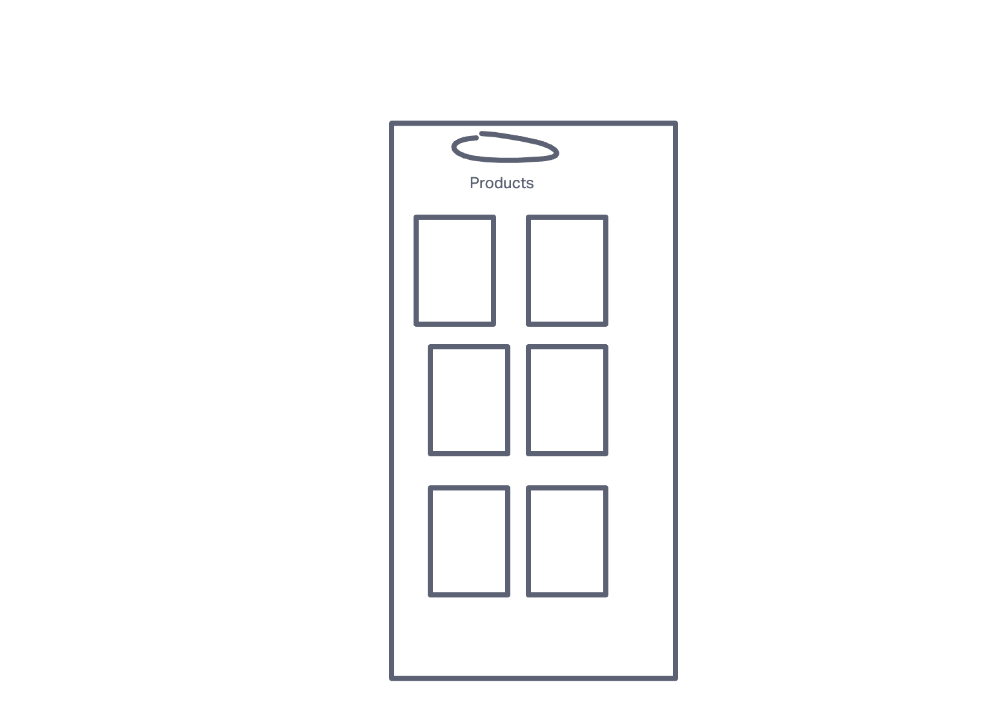
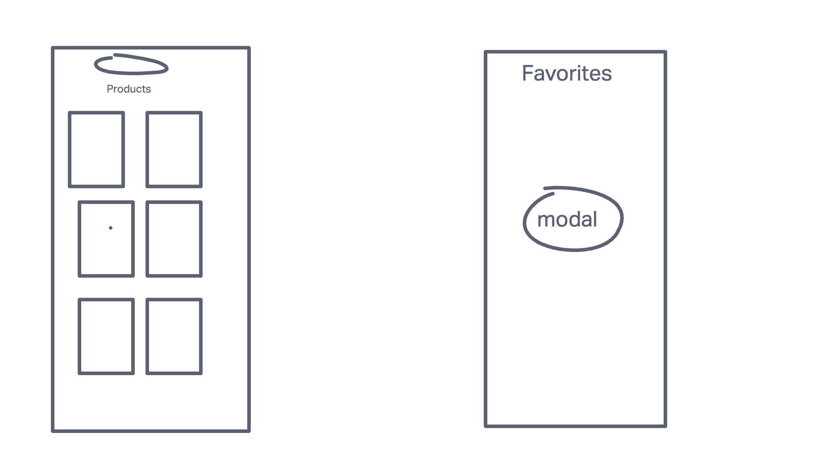
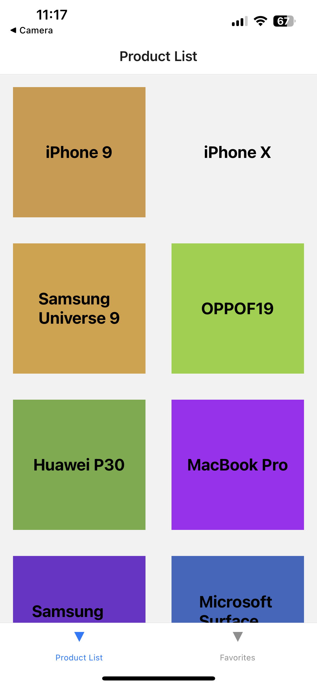
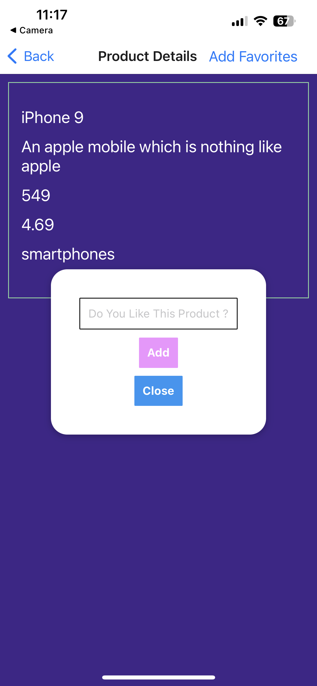

# LAB - Class 43 and 44

## Project: React Native Application

### Author: Malik Sadiki-Torres

### Problem Domain

Build an app using React Native components that uitlizes phone features.
### Links and Resources

### Collaborators

I referenced the demo code and this tutorial [React Native Tutorial For Beginners 2023](https://www.youtube.com/watch?v=HxWxcTwBjXU&list=PL0JfpSrXxTMyfQ0fWd2VFK6inHsHSNWc9&index=33&ab_channel=SangamMukherjee)

### Setup

Run `npx create-expo-app my-app`

Navigate to app `cd my-app`

#### UML

